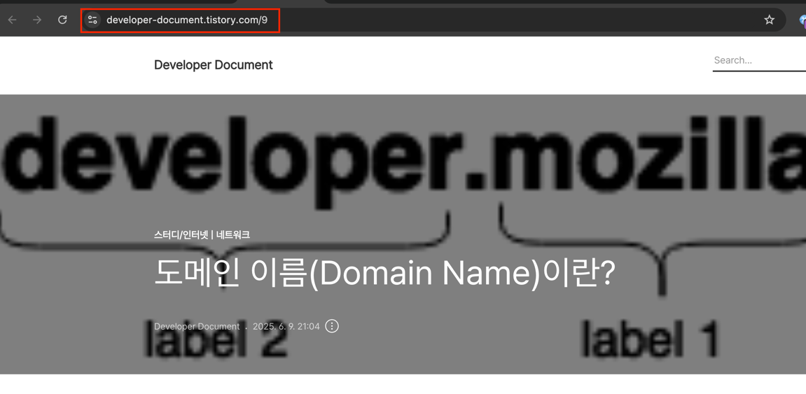
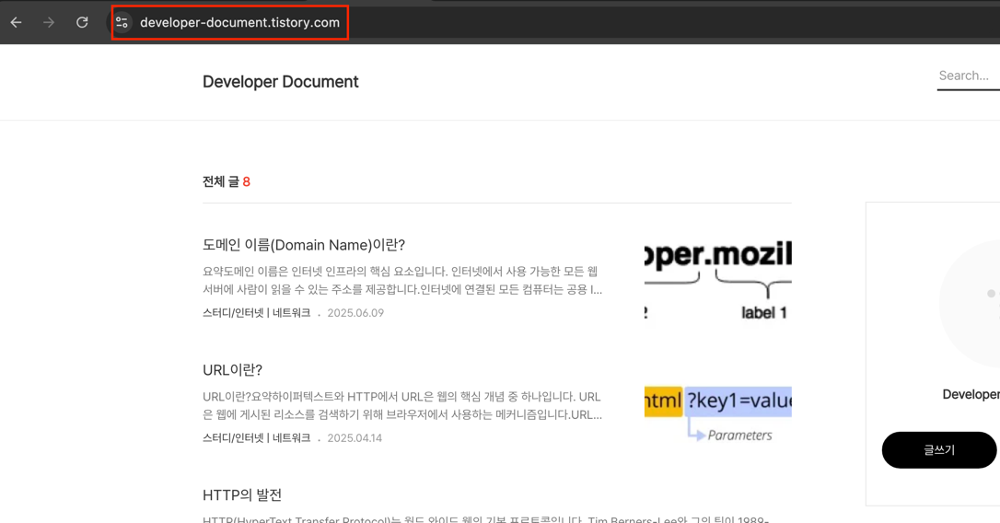

# 웹 페이지, 웹사이트, 웹 서버, 검색 엔진의 차이점

웹 페이지, 웹사이트, 웹 서버, 검색 엔진 등 다양한 웹 관련 개념에 대해 설명하는 것부터 시작하겠습니다. 이러한 용어는 웹 초보자가 혼동하거나 잘못 사용하는 경우가 많습니다. 각각의 의미를 알고 있는지 확인해 보겠습니다! 몇 가지 정의부터 시작하겠습니다.

### 웹 페이지
웹 브라우저에 표시할 수 있는 문서입니다. 이러한 문서는 종종 "페이지"라고도 불립니다. 이러한 문서는 HTML 언어로 작성되며 나중에 자세히 살펴보겠습니다.

### 웹사이트
웹 페이지 모음은 하나의 리소스로 그룹화되어 있으며, 이들을 연결하는 링크가 있습니다. 흔히 "사이트"라고 불립니다.

### 웹 서버
인터넷에서 웹사이트를 호스팅하는 컴퓨터입니다.

### 웹 서비스
기능을 수행하거나 데이터를 제공하라는 인터넷 요청에 응답하는 소프트웨어입니다. 웹 서비스는 일반적으로 웹 서버의 지원을 받으며, 사용자가 상호작용할 수 있는 웹 페이지를 제공할 수 있습니다.
많은 웹사이트도 웹 서비스이지만, 일부 웹사이트(예: MDN)는 정적인 콘텐츠로만 구성됩니다. 웹 서비스의 예로는 이미지 크기를 조정하거나 날씨 보고서를 제공하거나 사용자 로그인을 처리하는 것이 있습니다.

### 검색 엔진
Google, Bing, Yahoo 또는 DuckDuckGo와 같은 다른 웹 페이지를 찾는 데 도움이 되는 웹 서비스입니다. 검색 엔진은 일반적으로 웹 브라우저를 통해 액세스하거나(예: Firefox, Chrome 등의 주소 표시줄에서 직접 검색 엔진 검색을 수행할 수 있습니다) 웹 페이지(예: bing.com 또는 duckduckgo.com )를 통해 액세스할 수 있습니다.

공공 도서관을 예로 들어보겠습니다. 도서관을 방문할 때 일반적으로 하는 일입니다.

1. 검색 색인을 찾아서 원하는 책의 제목을 찾아보세요.
2. 책의 카탈로그 번호를 메모해 두세요.
3. 책이 포함된 특정 섹션으로 이동하여 올바른 카탈로그 번호를 찾은 다음 책을 가져오세요.

공공 도서관과 웹을 비교해 보겠습니다.

- 라이브러리는 웹 서버와 같습니다. 여러 섹션이 있어 여러 웹사이트를 호스팅하는 웹 서버와 비슷합니다.
- 도서관의 다양한 섹션(과학, 수학, 역사 등)은 웹사이트와 같습니다. 각 섹션은 고유한 웹사이트와 같습니다(두 섹션에는 동일한 책이 포함되어 있지 않습니다).
- 각 섹션의 책은 웹 페이지와 같습니다. 예를 들어, 과학 섹션(웹사이트)에는 열, 소리, 열역학, 정역학 등에 관한 책이 있을 수 있습니다.
- 검색 인덱스는 검색 엔진과 같습니다. 각 책은 라이브러리에서 고유한 위치를 가지고 있으며(두 권의 책은 같은 장소에 보관할 수 없습니다) 카탈로그 번호로 지정되어 있습니다.

이제 각 용어를 조금 더 자세히 살펴보겠습니다.

## 웹 페이지

웹 페이지는 브라우저에서 표시할 수 있는 간단한 문서입니다. 웹 페이지에는 다음과 같은 다양한 유형의 리소스가 포함될 수 있습니다.

- 스타일 정보 - 페이지의 모양과 느낌을 제어합니다.
- 스크립트 - 페이지에 상호작용성을 추가합니다.
- 미디어 - 이미지, 소리, 그리고 비디오.

`참고: 브라우저는 PDF 파일과 같은 다른 문서와 이미지 또는 동영상과 같은 기타 리소스도 표시할 수 있지만, 웹 페이지라는 용어는 HTML 문서를 의미합니다.`

모든 웹 페이지는 각각 고유한 위치(웹 주소, URL이라고도 함)에서 찾을 수 있습니다. 페이지에 액세스하려면 브라우저 주소 표시줄에 해당 주소를 입력하기만 하면 됩니다.

## 웹사이트

웹사이트는 고유한 도메인 이름을 공유하는 링크된 웹 페이지(및 관련 리소스)의 모음입니다. 주어진 웹사이트의 각 웹페이지는 사용자가 웹사이트의 한 페이지에서 다른 페이지로 이동할 수 있도록 클릭 가능한 텍스트 부분의 형태로 명시적인 링크를 제공합니다.

좋아하는 웹사이트를 브라우저에 로드하면 웹사이트의 메인 웹페이지 또는 홈페이지(일반적으로 "홈"이라고 함)가 먼저 표시되는 경향이 있습니다.

## 웹 서버
웹 서버는 하나 이상의 웹사이트를 호스팅하는 컴퓨터입니다. "호스팅"은 해당 컴퓨터에서 모든 웹 페이지와 관련 파일을 사용할 수 있음을 의미합니다. 웹 서버는 사용자가 웹 페이지 파일을 로드하려고 할 때 호스팅 중인 웹 페이지 파일을 브라우저로 전송합니다.

웹사이트와 웹 서버를 혼동하지 마세요. 예를 들어 누군가 "내 웹사이트가 응답하지 않는다"고 말하는 것을 들으면 실제로 웹 서버가 응답하지 않으므로 웹사이트를 사용할 수 없다는 뜻입니다. 
더 중요한 것은 웹 서버가 여러 개의 웹사이트를 호스팅할 수 있기 때문에 웹사이트를 지정할 때 웹 서버라는 용어를 사용하지 않는다는 것입니다. 이전 예제에서 "내 웹 서버가 응답하지 않는다"고 말했다면 해당 웹 서버의 여러 웹사이트를 사용할 수 없다는 뜻입니다.

## 검색 엔진
검색 엔진은 웹에서 흔히 발생하는 혼란의 원인입니다. 검색 엔진은 사용자가 다른 웹사이트에서 웹 페이지를 찾을 수 있도록 도와주는 특별한 종류의 웹사이트입니다.

Google, Bing, Yandex, DuckDuckGo 등 다양한 제품이 있습니다. 일부는 일반적이고 일부는 특정 주제에 특화되어 있습니다.
웹의 많은 초보자들은 검색 엔진과 브라우저를 혼동합니다. 분명히 말씀드리자면, 브라우저는 웹 페이지를 검색하여 표시하는 소프트웨어이고, 검색 엔진은 다른 웹사이트에서 웹 페이지를 찾을 수 있도록 도와주는 웹사이트입니다. 
이러한 혼란은 누군가 처음 브라우저를 실행할 때 브라우저에 검색 엔진의 홈페이지나 해당 검색 엔진을 사용하여 용어를 검색할 수 있는 검색 상자가 표시되는 경우가 많기 때문에 발생합니다. 또한 대부분의 브라우저는 사용자가 브라우저 주소 표시줄에 직접 검색어를 입력하여 검색 엔진을 사용할 수 있도록 허용합니다.

사람들이 브라우저에서 가장 먼저 하고 싶은 일은 표시할 웹 페이지를 찾는 것이기 때문에 이 모든 것이 이해가 됩니다. 소프트웨어(브라우저)와 서비스(검색 엔진)를 혼동하지 마세요.

## 웹 작동 방식: 기본 사항
전 세계 많은 지역에서 웹은 식기, 자전거, 자동차, 칫솔만큼이나 일상 생활에 필수적인 도구가 되었습니다. 비현실적으로 들린다면 매일 웹사이트나 휴대폰 앱을 얼마나 자주 사용하는지 생각해 보세요.
콘텐츠나 서비스에 액세스하기 위해 웹 브라우저에 웹 주소를 입력하지 않더라도 사용 중인 앱이 웹 기술을 사용하여 데이터를 수집하고 있을 가능성이 높습니다.

웹에 액세스할 때 첫 번째 상호작용(예: 브라우저에 웹 주소(URL)를 입력하고 Enter/Return을 누르는 등)과 작업 결과가 사용자에게 표시되는(예: 웹 브라우저에 표시되는 웹사이트) 사이에 많은 일이 발생합니다.

1. 웹 브라우저는 웹 서버에 저장된 웹 서버에서 액세스하려는 리소스(예: 웹 페이지, 일부 데이터 또는 이미지 또는 비디오)를 요청합니다. 이러한 요청(및 그에 따른 응답)은 HTTP(하이퍼텍스트 전송 프로토콜)라는 기술을 사용하여 이루어지며, 이 기술은 동사 언어(예: GET)를 사용하여 어떤 일이 일어나야 하는지 설명합니다.
2. 요청이 성공하면 웹 서버는 요청된 리소스가 포함된 웹 브라우저로 HTTP 응답을 다시 보냅니다.
3. 경우에 따라 요청된 리소스가 더 많은 HTTP 요청을 실행하여 더 많은 응답을 얻을 수 있습니다. 예를 들어:
   - 웹사이트가 로드되면 처음에는 웹사이트 홈페이지의 메인 인덱스 HTML 파일이 요청됩니다.
   - 해당 파일이 브라우저에 수신되면 구문 분석을 시작하고 더 많은 요청을 할 수 있는 지침을 찾을 수 있습니다. 위에서 설명한 것처럼 이미지, 스타일 정보, 스크립트 등과 같은 파일을 임베딩하기 위한 것일 수 있습니다.
4. 모든 리소스가 요청되면 웹 브라우저는 결과를 사용자에게 표시하기 전에 필요에 따라 파싱하고 렌더링합니다.

웹이 어떻게 작동하는지에 대한 이 설명은 매우 간단하지만, 이 시점에서 정말 알아야 할 것은 이것뿐입니다. 웹 표준 모듈에서 웹 브라우저가 웹 페이지를 요청하고 렌더링하는 방법에 대한 자세한 설명은 나중에 확인할 수 있습니다.

지금은 웹 브라우저를 열고 좋아하는 사이트 몇 개를 로드하면서 위의 단계들을 생각해 보세요.

## 정보 검색

웹 개발자가 되면 기억나지 않는 구문부터 특정 문제에 대한 해결책까지 많은 시간을 정보를 검색하는 데 할애하게 됩니다. 따라서 웹을 효과적으로 검색하는 방법을 배우는 것이 좋습니다.

특정 웹 기술 기능에 대한 일반적인 정보를 찾고 있다면 해당 기능의 이름을 MDN 검색 상자에 입력해야 합니다. 예를 들어, 검색 상자에 `box model`, `fetch()` 또는 `video element`를 입력하여 어떤 정보가 표시되는지 확인해 보세요. 필요한 정보를 찾지 못하면 검색을 확장하고 검색 엔진에서 검색어를 사용해 보세요.

`자바스크립트로 피보나치 수열을 출력하는 방법`이나 `자바스크립트로 숫자가 소수인지 계산하는 방법`과 같은 특정 문제에 대한 해결책을 찾고 있다면 프로그래밍 문제에 대한 답변 전용 커뮤니티인 StackOverflow와 같은 웹사이트에서 검색하는 것이 좋습니다. 다시 한 번 특정 사이트에서 유용한 답변을 제공하지 않는 경우 일반 검색 엔진을 사용해 보세요.

## AI 사용
AI로 생성된 검색 결과는 정보를 수신하는 매우 인기 있는 방법입니다. 이 검색 결과는 기본적으로 매우 강력한 검색 기능을 제공합니다. 백그라운드에서 많은 검색을 수행한 후 결과를 쉽게 digest할 수 있는 단일 답변으로 컴파일합니다. 
일반적으로 채팅 형식으로 직접 액세스하거나 AI 기반 인앱 도움말 또는 자동화 시스템을 통해 액세스하는 ChatGPT, Google Gemini, Microsoft Copilot을 선택할 수 있습니다.

코딩을 배울 때 AI 채팅 프롬프트는 다양한 방식으로 유용할 수 있습니다.

- 위의 예시와 같은 기존 검색을 수행합니다.
- 코드 블록의 버그를 파악하기. 코드가 작동하지 않아서 답답한 상황이라면, 코드를 AI 채팅 프롬프트에 붙여넣고 "이 코드의 오류는 어디에 있나요?"와 같은 질문을 먼저 할 수 있습니다.
- 특정 코드 블록의 최적화된 버전 생성. 이는 작동하는 코드 블록을 작성할 때 유용할 수 있지만, 더 효율적으로 수행할 수 있는 방법이나 더 많은 사용 사례를 해결하는 더 견고한 방법을 찾고자 할 때 유용합니다.
- 어떤 작업을 수행하는 방법에 대한 조언을 제공합니다. 예를 들어, 코드 블록에서 버그가 어디에 있는지 알고 싶지 않고, 버그를 디버깅하는 데 어떤 전략을 사용해야 하는지에 대한 조언을 원합니다.

### 출처
- https://developer.mozilla.org/en-US/docs/Learn_web_development/Getting_started/Environment_setup/Browsing_the_web