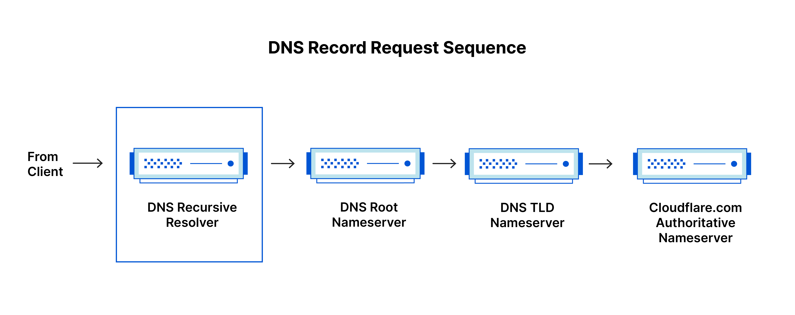
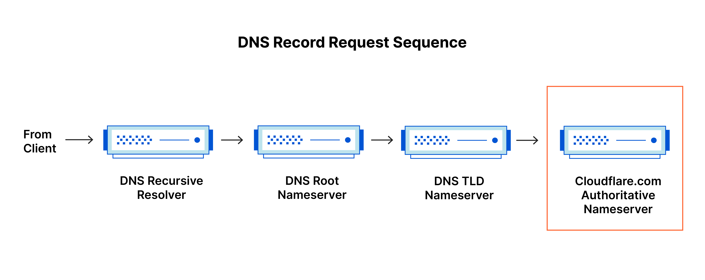
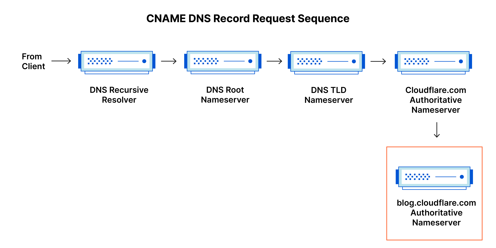
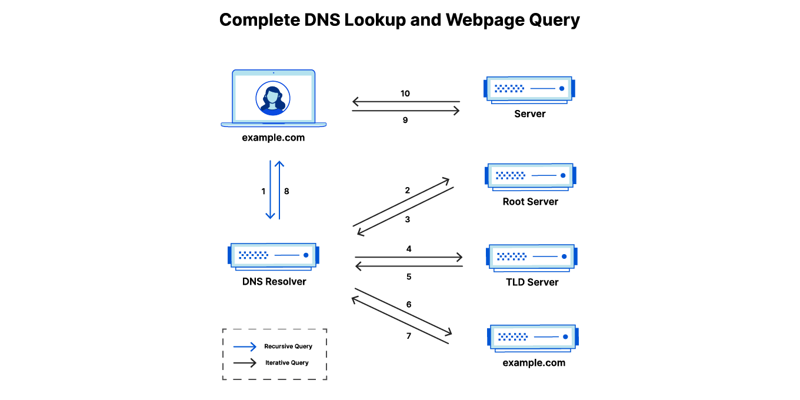
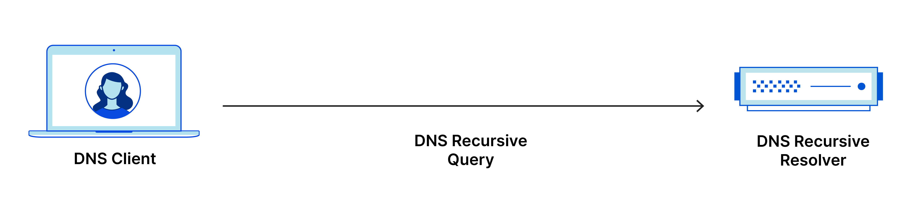

# DNS란 무엇인가?

DNS(Domain Name System)는 인터넷 전화번호부입니다. 사용자는 nytimes.com 또는 espn.com과 같은 도메인 이름을 통해 온라인으로 정보에 액세스합니다.
웹 브라우저는 인터넷 프로토콜(IP) 주소를 통해 상호작용합니다. DNS는 브라우저가 인터넷 자원을 로드할 수 있도록 도메인 이름을 IP 주소로 변환합니다.

인터넷에 연결된 각 기기에는 다른 컴퓨터가 기기를 찾는 데 사용하는 고유한 IP 주소가 있습니다.
DNS 서버를 사용하면 사람이 192.168.1.1(IPv4의 경우)과 같은 IP 주소 또는 2400:cb00:2048:1::c629:d7a2(IPv6의 경우)처럼 영문과 숫자로 된 복잡한 IP 주소를 기억할 필요가 없습니다.

## DNS는 어떻게 작동하나요?
DNS 확인 프로세스에는 호스트 이름(예: www.example.com)을 컴퓨터 친화적인 IP 주소(예: 192.168.1.1)로 변환하는 과정이 포함됩니다. 
IP 주소는 인터넷의 각 기기에 제공되며, 거리 주소가 특정한 집을 찾는 데 사용되는 것처럼, 적절한 인터넷 기기를 찾기 위해서는 IP 주소가 필요합니다. 
사용자가 어떤 웹페이지를 로드하려고 할 때에는 사용자가 웹브라우저에 입력한 내용(예: example.com)을 example.com 웹페이지를 찾는 데 필요한 컴퓨터 친화적 주소로 변환해야 합니다.

DNS 확인의 기반 프로세스를 이해하려면, DNS 쿼리가 통과해야 하는 다양한 하드웨어 구성 요소에 대해 알아야 합니다. 
웹브라우저 입장에서는 DNS 확인이 "막후에서" 발생하며 최초의 사용자 요청 외에 사용자 컴퓨터와의 추가적인 대화는 필요하지 않습니다.

### 웹 페이지로드와 관련된 4개의 DNS 서버

- DNS Recursor - Recursor는 도서관의 어딘가에서 특정한 책을 찾아달라고 요청받는 사서로 생각할 수 있습니다. DNS Recursor는 웹 브라우저 등의 애플리케이션을 통해 클라이언트 컴퓨터로부터 쿼리를 받도록 고안된 서버입니다. 일반적으로, 리커서는 클라이언트의 DNS 쿼리를 충족시키기 위해 추가 요청을 수행합니다.
- 루트 이름 서버 - 루트 서버는 사람이 읽을 수 있는 호스트 이름을 IP 주소로 변환(확인)하는 첫 번째 단계입니다. 도서관에서 책장 위치를 가리키는 색인으로 생각할 수 있으며, 일반적으로 다른 더욱 특정한 위치에 대한 참조로 사용됩니다.
- TLD 이름 서버 - TLD(Top Level Domain, 최상위 도메인) 서버는 도서관의 특정 책장으로 생각할 수 있습니다. 이 이름 서버는 특정 IP 주소 검색의 다음 단계이며 호스트 이름의 마지막 부분을 호스팅합니다 (example.com에서 TLD 서버는 “com”입니다).
- 권한 있는 이름 서버 - 최종 이름 서버로서, 책장에 있는 사전처럼 특정 이름을 해당 정의로 변환합니다. 권한있는 이름 서버는 이름 서버 쿼리의 종착점입니다. 권한있는 이름 서버가 요청한 레코드에 대한 액세스 권한이 있다면, 요청한 호스트 이름의 IP 주소를 초기 요청을 한 DNS 리커서(사서)에게 돌려 보냅니다.

## 권한 있는 DNS 서버와 재귀 DNS resolver의 차이점

두 개념은 모두 DNS 인프라에 통합된 서버(서버 그룹)를 나타내지만, 각각 다른 역할을 수행하며 DNS 쿼리 파이프라인 내부의 다른 위치에 있습니다. 
차이점에 대해 생각하는 한 가지 방법은, 재귀 resolver는 DNS 쿼리의 시작 부분에 있고 권한 있는 이름 서버는 끝부분에 있다는 것입니다.

### 재귀 DNS resolver
재귀 resolver는 클라이언트의 재귀 요청에 응답하고 DNS 레코드를 추적하는 데 시간을 투자하는 컴퓨터입니다. 
요청한 레코드에 대해, 권한있는 DNS 이름 서버에 도달할 때까지 일련의 요청을 하는 방식으로 이를 수행합니다(또는 레코드가 없으면 시간 초과되거나 오류를 반환). 
다행히 재귀 DNS resolver가 클라이언트에 응답하는 데 필요한 레코드를 추적하기 위해 항상 다수의 요청을 해야 하는 것은 아닙니다. 
캐싱은 DNS 조회 초기에, 요청한 자원 레코드를 제공하여 필요한 요청을 단락시키는 데 도움이 되는 데이터 지속성 프로세스입니다.



### 권한 있는 DNS 서버
간단히 말해서, 권한 있는 DNS 서버는 실제로 DNS 리소스 레코드를 보유하고 담당하는 서버입니다. 
이 서버는 쿼리한 자원 레코드로 응답하는 DNS 조회 체인의 맨 아래에 있는 서버로, 궁극적으로 웹 브라우저가 웹사이트 또는 다른 웹 자원에 액세스하는 데 필요한 IP 주소에 도달하도록 요청할 수 있게 합니다. 
권한 있는 이름 서버는 특정 DNS 레코드의 최종 원천이므로 다른 원천을 쿼리할 필요없이 자체 데이터의 쿼리를 충족시킬 수 있습니다.



foo.example.com 또는 blog.cloudflare.com과 같은 하위 도메인에 대한 쿼리인 경우, 추가 이름 서버가 권한 있는 이름 서버 다음의 시퀀스에 추가되어 하위 도메인의 CNAME 레코드 저장을 담당한다는 점도 참고로 하십시오.



## DNS 조회 단계
대부분의 경우, DNS는 도메인 이름을 적절한 IP 주소로 변환하는 일에 관여합니다. 
이 프로세스의 작동 방식을 알려면, 웹 브라우저에서 DNS 조회 프로세스를 거쳐 다시 돌아오는 DNS 조회 경로를 따르는 것이 도움이 됩니다. 
이 단계를 살펴보겠습니다.

```text
참고: DNS 조회 정보는 쿼리 컴퓨터 내부에서 로컬로 또는 DNS 인프라에서 원격으로 캐시되는 경우가 많습니다. 
DNS 조회에는 일반적으로 8단계가 있지만, DNS 정보가 캐시되어 있으면 DNS 조회 프로세스에서 몇 단계를 건너 뛸 수 있으므로, 더 빨라집니다. 아래 예시는 캐시되지 않은 8단계를 모두 보여줍니다.
```

### DNS 조회의 8단계:
1. 사용자가 웹 브라우저에 'example.com'을 입력하면, 쿼리가 인터넷으로 이동하고 DNS 재귀 확인자가 이를 수신합니다.
2. 이어서 확인자가 DNS 루트 이름 서버(.)를 쿼리합니다.
3. 다음으로, 루트 서버가, 도메인에 대한 정보를 저장하는 최상위 도메인(TLD) DNS 서버(예: .com 또는 .net)의 주소로 확인자에 응답합니다. example.com을 검색할 경우의 요청은 .com TLD를 가리킵니다.
4. 이제, 확인자가 .com TLD에 요청합니다.
5. 이어서, TLD 서버가 도메인 이름 서버(example.com)의 IP 주소로 응답합니다.
6. 마지막으로, 재귀 확인자가 도메인의 이름 서버로 쿼리를 보냅니다.
7. 이제, example.com의 IP 주소가 이름 서버에서 확인자에게 반환됩니다.
8. 이어서, DNS 확인자가, 처음 요청한 도메인의 IP 주소로 웹 브라우저에 응답합니다.

DNS 조회의 8단계를 거쳐 example.com의 IP 주소가 반환되면, 이제 브라우저가 웹 페이지를 요청할 수 있습니다.

9. 브라우저가 IP 주소로 HTTP 요청을 보냅니다.
10. 해당 IP의 서버가 브라우저에서 렌더링할 웹 페이지를 반환합니다(10단계).



## DNS Resolver란?
DNS Resolver는 DNS 조회의 첫 번째 중단점이며, 최초 요청을 한 클라이언트 처리를 담당합니다.
Resolver는 URL이 궁극적으로 필요한 IP 주소로 변환되도록 하는 일련의 쿼리를 시작합니다.

참고: 캐시되지 않은 일반적인 DNS 조회에는 재귀 쿼리와 반복 쿼리가 모두 포함됩니다.

재귀 DNS 쿼리와 재귀 DNS Resolver를 구분하는 것이 중요합니다. 
쿼리는 쿼리 확인을 요구하는 DNS Resolver에게 하는 요청을 의미합니다. 
DNS 재귀 Resolver는 재귀 쿼리를 수락하고 필요한 요청을 수행하는 방식으로 응답을 처리하는 컴퓨터입니다.



## DNS 쿼리 유형
일반적인 DNS 조회에서는 세 가지 유형의 쿼리가 발생합니다. 
이러한 쿼리 조합을 사용하면 DNS 확인을 위한 최적화된 프로세스가 되어 이동 거리를 줄일 수 있습니다. 
이상적인 상황에서는, 캐시된 레코드 데이터를 사용할 수 있으므로, DNS 이름 서버가 비재귀 쿼리를 반환할 수 있습니다.

### 세 가지 유형의 DNS 쿼리:
1. 재귀 쿼리
재귀 쿼리에서는, resolver가 레코드를 찾을 수 없는 경우, DNS 클라이언트는 DNS 서버(일반적으로 DNS 재귀 확인자)가, 요청한 자원 레코드 또는 오류 메시지를 사용하여 클라이언트에 응답하도록 요구합니다.

2. 반복 쿼리
이 경우, DNS 클라이언트는 DNS 서버가 가능한 최상의 응답을 반환하도록 합니다. 
쿼리한 DNS 서버가 쿼리 이름과 일치하는 이름을 갖고 있지 않은 경우, 하위 수준의 도메인 네임스페이스에 대해 권한 있는 DNS 서버에 대한 참조를 반환합니다. 
그러면 DNS 클라이언트가 참조 주소를 쿼리합니다. 이 프로세스는 오류 또는 제한 시간 초과가 발생할 때까지 추가 DNS 서버가 쿼리 체인을 중단한 상태로 계속됩니다.

3. 비재귀 쿼리
일반적으로, DNS resolver 클라이언트의 쿼리를 받은 DNS 서버가 해당 레코드에 대한 권한이 있거나 캐시 내부에 해당 레코드를 갖고 있어, DNS 서버가 액세스 권한을 갖고 있는 레코드를 쿼리할 때 발생합니다. 
일반적으로, DNS 서버는 추가 대역폭 소비 및 업스트림 서버의 부하를 방지하기 위해 DNS 레코드를 캐시합니다.

## DNS 캐싱이란?
캐싱의 목적은 데이터를 임시 저장하여, 데이터 요청에 대해 성능과 신뢰성을 높이는 것입니다. 
DNS 캐싱은 요청하는 클라이언트와 가까운 곳에 데이터를 저장함으로써, DNS 쿼리를 조기에 확인할 수 있고 DNS 조회 체인의 추가 쿼리를 피할 수 있으므로, 로드 시간이 향상되고 대역폭/CPU 소비가 줄어듭니다. 
DNS 데이터는 다양한 위치에 캐시될 수 있으며, 각 위치는 TTL(Time-To-Live)에 의해 정의된 설정 시간 동안 DNS 레코드를 저장합니다.

### 브라우저 DNS 캐싱
최신 웹 브라우저는 기본적으로 정해진 시간 동안 DNS 레코드를 캐시하도록 설계되었습니다. 그 목적은 분명합니다. 
DNS 캐싱이 웹 브라우저와 가까울수록 캐시를 확인하고 IP 주소에 대한 올바른 요청을 하기 위해 처리해야 할 단계가 적어집니다.
DNS 레코드를 요청할 때 브라우저 캐시에서 처음으로 요청한 레코드를 확인하는 것입니다.

Chrome에서는 chrome://net-internals/#dns에서 DNS 캐시의 상태를 볼 수 있습니다.

### 운영 체제(OS) 수준 DNS 캐싱
운영 체제 수준 DNS resolver는 DNS 쿼리가 컴퓨터를 떠나기 전의 두 번째 중단점이며, 로컬에 있는 마지막 중단점입니다. 
이 쿼리를 처리하도록 설계된 운영 체제 내부의 프로세스를 일반적으로 "stub resolver" 또는 DNS 클라이언트라고 합니다. 
stub resolver는 애플리케이션에서 요청을 받으면 먼저 자체 캐시를 검사하여 레코드가 있는지 확인합니다. 
레코드가 없으면 로컬 네트워크 외부의 (재귀 플래그가 설정된) DNS 쿼리를 인터넷 서비스 공급자(ISP) 내부의 DNS 재귀 확인자로 보냅니다.

ISP 내부의 재귀 resolver가 모든 이전 단계와 같이 DNS 쿼리를 수신하면, 요청한 호스트-IP-주소 변환이 로컬 지속성 계층 내에 이미 저장되어 있는지도 확인합니다.

재귀 resolver에는 캐시에 있는 레코드 유형에 따른 추가 기능도 있습니다.

1. resolver가 A 레코드는 갖고 있지 않지만, 권한있는 이름 서버에 대한 NS 레코드를 갖고 있는 경우에는, DNS 쿼리의 여러 단계를 거치지 않고 해당 이름 서버를 직접 쿼리합니다. 이 바로가기는 루트 및 .com 이름 서버(예: example.com 검색)로부터의 조회를 방지하고 DNS 쿼리의 확인이 더 빨리 이루어지도록 도와줍니다.
2. 확인자에 NS 레코드가 없는 경우, 루트 서버를 건너뛰고 TLD 서버(이 경우 .com)로 쿼리를 보냅니다.
3. 확인자에 TLD 서버를 가리키는 레코드가 없는 경우, 루트 서버를 쿼리합니다. 이 이벤트는 일반적으로 DNS 캐시가 제거된 후에 발생합니다.

## 출처
- https://www.cloudflare.com/en-gb/learning/dns/what-is-dns/