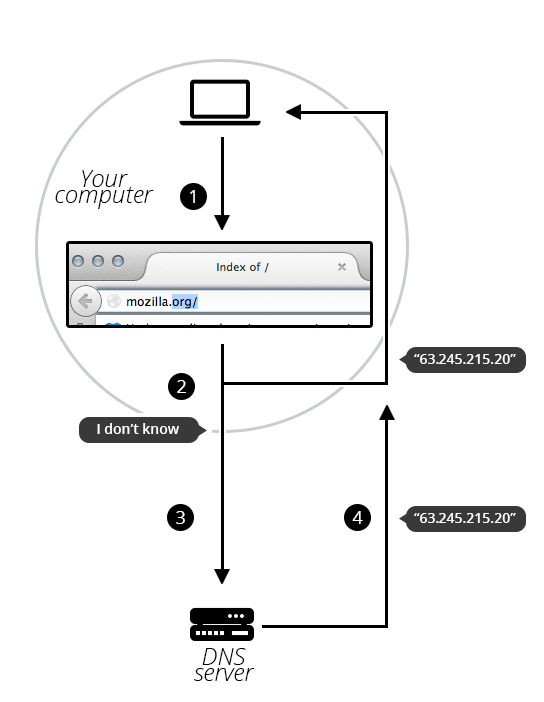

# 도메인 이름(Domain Name)이란?

## 요약

도메인 이름은 인터넷 인프라의 핵심 요소입니다. 인터넷에서 사용 가능한 모든 웹 서버에 사람이 읽을 수 있는 주소를 제공합니다.
인터넷에 연결된 모든 컴퓨터는 공용 IP 주소 (IPv4 주소(예: 192.0.2.172) 또는 IPv6 주소(예: 2001:db8:8b73:0000:0000:8a2e:0370:1337))를 통해 접속할 수 있습니다.
컴퓨터는 이러한 주소를 쉽게 처리할 수 있지만, 사람들은 서버를 운영하는 사람이 누구인지, 웹사이트가 어떤 서비스를 제공하는지 알아내는 데 어려움을 겪습니다. IP 주소는 기억하기 어렵고 시간이 지남에 따라 변경될 수 있습니다.
이러한 모든 문제를 해결하기 위해 우리는 도메인 이름이라는 사람이 읽을 수 있는 주소를 사용합니다.

## 더 깊이 파고들기
### 도메인 이름의 구조

도메인 이름은 여러 부분으로 구성된 간단한 구조를 가지고 있습니다(한 부분만 있을 수도 있고, 두 부분, 세 부분일 수도 있습니다...). 점으로 구분되어 있으며 오른쪽에서 왼쪽으로 읽습니다.


각 부분은 전체 도메인 이름에 대한 구체적인 정보를 제공합니다.

#### TLD (최상위 도메인)
TLD(top-level domain)는 사용자에게 도메인 이름 뒤에 숨겨진 서비스의 일반적인 목적을 알려줍니다. 가장 일반적인 TLD(`.com`, `.org`, `.net`)는 웹 서비스가 특정 기준을 충족할 것을 요구하지 않지만, 일부 TLD는 더 엄격한 정책을 적용하여 목적을 더 명확하게 보여줍니다. 

예를 들면 다음과 같습니다.

- `.us`, `.fr`, 또는 `.se`와 같은 로컬 TLD는 서비스가 특정 언어로 제공되거나 특정 국가에서 호스팅되도록 요구할 수 있습니다. 이는 특정 언어나 국가의 리소스를 나타내도록 되어 있습니다.
- `.gov` TLD를 포함하는 것은 정부 부서에서만 사용할 수 있습니다.
- `.edu` TLD는 교육 및 학술 기관에서만 사용할 수 있습니다.

TLD는 라틴 문자뿐만 아니라 특수 문자도 포함할 수 있습니다. TLD의 최대 길이는 63자이지만, 대부분은 2~3자 정도입니다.
TLD의 전체 목록은 [ICANN](https://www.icann.org/en/contracted-parties/registry-operators/resources/list-of-top-level-domains)에서 관리합니다.

#### 레이블 (또는 구성 요소)
레이블은 TLD 다음에 오는 것입니다. 레이블은 대소문자를 구분하지 않는 1자에서 63자 길이의 문자열로, A부터 Z까지의 문자, 0부터 9까지의 숫자, 그리고 '-' 문자(레이블의 첫 번째 또는 마지막 문자가 아닐 수 있음)만 포함합니다. `a`, `97`, `hello-strange-person-16-how-are-you`는 모두 유효한 레이블의 예입니다.

TLD 바로 앞에 있는 라벨은 SLD(Secondary Level Domain)라고도 합니다.

도메인 이름에는 여러 개의 라벨(또는 구성 요소)이 있을 수 있습니다. 도메인 이름을 구성하는 데 라벨이 3개일 필요는 없습니다.
예를 들어, `informatics.ed.ac.uk`는 유효한 도메인 이름입니다. 관리하는 모든 도메인(예: mozilla.org)에 대해 `developer.mozilla.org`, `support.mozilla.org` 또는 `bugzilla.mozilla.org`와 같이 각 도메인에 다른 콘텐츠가 있는 "하위 도메인"을 만들 수 있습니다.

## 도메인 이름 구매
### 도메인 이름은 누가 소유합니까?

"도메인 이름을 구매"할 수는 없습니다. 이는 사용하지 않는 도메인 이름을 나중에 다른 사람이 다시 사용할 수 있도록 하기 위한 것입니다. 
모든 도메인 이름을 구매하면, 웹은 잠기고 아무도 사용할 수 없는 사용되지 않는 도메인 이름으로 빠르게 채워질 것입니다.

대신, 도메인 이름을 1년 이상 사용할 수 있는 권한에 대한 비용을 지불합니다. 권한을 갱신할 수 있으며, 갱신된 권한은 다른 사람의 신청보다 우선합니다. 하지만 도메인 이름을 소유하는 것은 아닙니다.

등록기관이라 불리는 회사는 도메인 이름 등록기관을 이용해 사용자를 도메인 이름에 연결하는 기술 및 관리 정보를 추적합니다.

```text
참고 : 일부 도메인 이름의 경우, 등록기관이 직접 관리하지 않을 수 있습니다. 예를 들어, `.fire` 아래의 모든 도메인 이름은 Amazon에서 관리합니다.
```

## 사용 가능한 도메인 이름 찾기
주어진 도메인 이름을 사용할 수 있는지 확인하려면

- 도메인 등록기관 웹사이트를 방문하세요. 대부분의 등록기관은 도메인 이름 사용 가능 여부를 알려주는 "whois" 서비스를 제공합니다.
- 또는 셸이 내장된 시스템을 사용하는 경우  같이 명령을 입력합니다.

```bash
$ whois mozila.org
```

위 명령어를 실행 시 다음과 같이 출력됩니다.

```bash
Domain Name: mozila.org
Registry Domain ID: 2427568dd3ab498b9a946fd5307e111d-LROR
Registrar WHOIS Server: http://whois.markmonitor.com
Registrar URL: http://www.markmonitor.com
Updated Date: 2024-01-23T22:10:52Z
Creation Date: 2017-02-07T14:30:29Z
Registry Expiry Date: 2026-02-07T14:30:29Z
Registrar: MarkMonitor Inc.
Registrar IANA ID: 292
Registrar Abuse Contact Email: abusecomplaints@markmonitor.com
Registrar Abuse Contact Phone: +1.2083895740
Domain Status: clientDeleteProhibited https://icann.org/epp#clientDeleteProhibited
Domain Status: clientTransferProhibited https://icann.org/epp#clientTransferProhibited
Domain Status: clientUpdateProhibited https://icann.org/epp#clientUpdateProhibited
Registry Registrant ID: REDACTED
Registrant Name: REDACTED
Registrant Organization: Mozilla Corporation
Registrant Street: REDACTED
Registrant City: REDACTED
Registrant State/Province: CA
Registrant Postal Code: REDACTED
Registrant Country: US
Registrant Phone: REDACTED
Registrant Phone Ext: REDACTED
Registrant Fax: REDACTED
Registrant Fax Ext: REDACTED
Registrant Email: REDACTED
Registry Admin ID: REDACTED
Admin Name: REDACTED
Admin Organization: REDACTED
Admin Street: REDACTED
Admin City: REDACTED
Admin State/Province: REDACTED
Admin Postal Code: REDACTED
Admin Country: REDACTED
Admin Phone: REDACTED
Admin Phone Ext: REDACTED
Admin Fax: REDACTED
Admin Fax Ext: REDACTED
Admin Email: REDACTED
Registry Tech ID: REDACTED
Tech Name: REDACTED
Tech Organization: REDACTED
Tech Street: REDACTED
Tech City: REDACTED
Tech State/Province: REDACTED
Tech Postal Code: REDACTED
Tech Country: REDACTED
Tech Phone: REDACTED
Tech Phone Ext: REDACTED
Tech Fax: REDACTED
Tech Fax Ext: REDACTED
Tech Email: REDACTED
Name Server: ns1.markmonitor.com
Name Server: ns2.markmonitor.com
Name Server: ns3.markmonitor.com
Name Server: ns4.markmonitor.com
Name Server: ns5.markmonitor.com
Name Server: ns6.markmonitor.com
Name Server: ns7.markmonitor.com
DNSSEC: unsigned
```

보시다시피, `mozilla.org` 도메인은 Mozilla Foundation에서 이미 등록했기 때문에 등록할 수 없습니다.

반면에, `document-k.com` 이라는 도메인을 내가 등록할 수 있는지 살펴보겠습니다.

```bash
$ whois document-k.com

No match for domain "DOCUMENT-K.COM".
```

보시다시피 해당 도메인은 whois 데이터베이스에 존재하지 않으므로 등록을 요청할 수 있습니다.

### 도메인 이름 얻기
이 과정은 매우 간단합니다.

1. 등록기관의 웹사이트로 가세요.
2. 보통 눈에 잘 띄는 "도메인 이름 얻기"라는 문구가 있습니다. 클릭해 보세요.
3. 필요한 모든 정보를 양식에 입력하세요. 특히 원하는 도메인 이름을 잘못 입력하지 않았는지 확인하세요. 결제가 완료되면 너무 늦습니다!
4. 도메인 이름이 정상적으로 등록되면 등록기관에서 알려드립니다. 몇 시간 내에 모든 DNS 서버가 귀하의 DNS 정보를 수신하게 됩니다.

```text
참고: 이 과정에서 등록기관은 실제 주소를 요청합니다. 일부 국가에서는 등록기관이 유효한 주소를 제공하지 못할 경우 도메인을 폐쇄해야 할 수도 있으므로, 주소를 정확하게 입력해야 합니다.
```

### DNS 새로 고침

DNS 데이터베이스는 전 세계 모든 DNS 서버에 저장되어 있으며, 이러한 모든 서버는 "권한 있는 이름 서버" 또는 "최상위 DNS 서버"라고 하는 몇 개의 특수 서버를 참조합니다. 이는 시스템을 관리하는 상위 서버와 같습니다.
등록 기관이 특정 도메인에 대한 정보를 생성하거나 업데이트할 때마다 모든 DNS 데이터베이스에서 해당 정보를 새로 고쳐야 합니다. 
특정 도메인을 알고 있는 각 DNS 서버는 해당 정보를 일정 시간 동안 저장한 후 자동으로 무효화되고 새로 고쳐집니다(DNS 서버는 권한 있는 서버에 쿼리를 보내 업데이트된 정보를 가져옵니다). 
따라서 해당 도메인 이름을 알고 있는 DNS 서버가 최신 정보를 가져오는 데 시간이 걸립니다.

## DNS 요청은 어떻게 작동하나요?
앞서 살펴보았듯이, 브라우저에 웹페이지를 표시할 때 IP 주소보다 도메인 이름을 입력하는 것이 더 쉽습니다. 그 과정을 살펴보겠습니다.

1. 브라우저의 위치 표시줄에 `mozilla.org`를 입력하세요.
2. 브라우저는 로컬 DNS 캐시를 사용하여 해당 도메인 이름으로 식별된 IP 주소를 컴퓨터가 이미 인식하는지 확인합니다. 인식하는 경우, 해당 이름을 IP 주소로 변환하고 브라우저는 웹 서버와 콘텐츠를 협상합니다. 이것으로 끝입니다.
3. 컴퓨터가 이름 뒤에 있는 IP 주소를 알지 못하는 경우 `mozilla.org` 도메인을 DNS 서버에 문의합니다. DNS 서버의 역할은 각 등록된 도메인 이름과 일치하는 IP 주소가 무엇인지 컴퓨터에 알려주는 것입니다.
4. 이제 컴퓨터가 요청한 IP 주소를 알게 되었으므로 브라우저는 웹 서버와 콘텐츠를 협상할 수 있습니다.



## 출처
- https://developer.mozilla.org/en-US/docs/Learn_web_development/Howto/Web_mechanics/What_is_a_domain_name