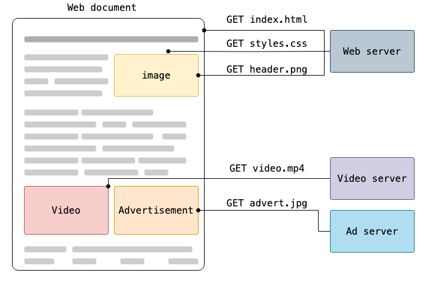
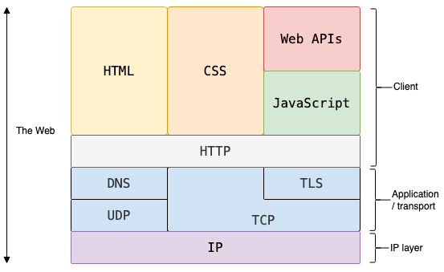
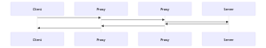
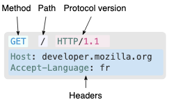
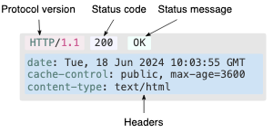

# HTTP란 무엇인가?

## 개요
HTTP는 HTML 문서와 같은 리소스를 가져오기 위한 프로토콜입니다. 
HTTP는 웹에서 모든 데이터 교환의 기초가 되며 클라이언트-서버 프로토콜입니다. 
이는 요청이 수신자, 일반적으로 웹 브라우저에 의해 시작된다는 것을 의미합니다. 
전체 문서는 일반적으로 텍스트 콘텐츠, 레이아웃 지침, 이미지, 비디오, 스크립트 등과 같은 리소스로 구성됩니다.



클라이언트와 서버는 데이터 스트림이 아닌 개별 메시지를 교환하여 통신합니다. 
클라이언트가 보낸 메시지를 요청이라고 하고 서버가 응답으로 보낸 메시지를 응답이라고 합니다.


HTTP는 애플리케이션 계층 프로토콜로서 TCP(전송 계층)와 IP(네트워크 계층) 위에, 그리고 프레젠테이션 계층 아래에 있습니다.

1990년대 초에 설계된 HTTP는 시간이 지남에 따라 발전해 온 확장 가능한 프로토콜입니다. 
HTTP는 TCP 또는 TLS로 암호화된 TCP 연결을 통해 전송되는 애플리케이션 계층 프로토콜이지만, 이론적으로는 신뢰할 수 있는 전송 프로토콜도 사용할 수 있습니다.
확장성 덕분에 하이퍼텍스트 문서뿐만 아니라 이미지와 동영상을 가져오거나 HTML 양식 결과와 같이 서버에 콘텐츠를 게시하는 데에도 사용됩니다. 
HTTP는 또한 문서의 일부를 가져와 필요에 따라 웹 페이지를 업데이트하는 데에도 사용할 수 있습니다.

## HTTP 기반 시스템의 구성 요소
HTTP는 클라이언트-서버 프로토콜입니다: 요청은 하나의 엔티티, 즉 사용자-에이전트(또는 이를 대신하는 프록시)에 의해 전송됩니다.
대부분의 경우 사용자-에이전트는 웹 브라우저이지만, 예를 들어 검색 엔진 인덱스를 채우고 유지하기 위해 웹을 크롤링하는 로봇과 같은 것일 수 있습니다.

각 개별 요청은 서버로 전송되며, 서버는 이를 처리하고 응답이라는 응답을 제공합니다. 
클라이언트와 서버 사이에는 프록시라고 하는 수많은 엔티티가 있으며, 프록시는 서로 다른 작업을 수행하고 게이트웨이 또는 캐시 역할을 합니다.



실제로 브라우저와 요청을 처리하는 서버 사이에는 라우터, 모뎀 등의 컴퓨터가 더 많이 있습니다.
웹의 계층적 설계 덕분에 이러한 컴퓨터는 네트워크 및 전송 계층에 숨겨져 있습니다. 
HTTP는 애플리케이션 계층 위에 있습니다.
네트워크 문제를 진단하는 데 중요하지만 기본 계층은 HTTP의 설명과 대부분 무관합니다.

### 클라이언트: 사용자 에이전트
사용자 에이전트는 사용자를 대신하여 작동하는 모든 도구입니다. 
이 역할은 주로 웹 브라우저에서 수행되지만, 엔지니어와 웹 개발자가 애플리케이션을 디버깅하는 데 사용하는 프로그램에서도 수행될 수 있습니다.

브라우저는 항상 요청을 시작하는 주체입니다.
결코 서버는 아닙니다(몇몇 메커니즘이 수년에 걸쳐 서버에서 시작하는 메시지를 시뮬레이션하기 위해 추가되었지만)

웹 페이지를 표시하기 위해 브라우저는 페이지를 나타내는 HTML 문서를 가져오라는 원본 요청을 보냅니다. 
그런 다음 이 파일을 구문 분석하여 실행 스크립트, 표시할 레이아웃 정보(CSS), 페이지 내에 포함된 하위 리소스(일반적으로 이미지 및 동영상)에 해당하는 추가 요청을 합니다. 
그런 다음 웹 브라우저는 이러한 리소스를 결합하여 전체 문서인 웹 페이지를 표시합니다. 
브라우저에서 실행되는 스크립트는 이후 단계에서 더 많은 리소스를 가져올 수 있으며, 브라우저는 이에 따라 웹 페이지를 업데이트합니다.

웹 페이지는 하이퍼텍스트 문서입니다. 
즉, 표시되는 콘텐츠의 일부는 링크로, 보통 마우스를 클릭하여 활성화하여 새 웹 페이지를 가져올 수 있습니다.
이를 통해 사용자는 사용자 에이전트를 안내하고 웹을 탐색할 수 있습니다.
브라우저는 이러한 지시를 HTTP 요청으로 변환하고, HTTP 응답을 해석하여 사용자에게 명확한 응답을 제공합니다.

### 웹 서버
통신 채널의 반대편에는 클라이언트가 요청한 대로 문서를 제공하는 서버가 있습니다.
서버는 가상으로 단일 머신으로 나타나지만 실제로는 부하를 공유하는 서버들의 모음(부하 분산)이거나 다른 소프트웨어(캐시, 데이터베이스 서버 또는 전자 상거래 서버 등)가 필요에 따라 문서를 전부 또는 부분적으로 생성하는 것일 수 있습니다.

서버는 반드시 단일 머신은 아니지만, 여러 서버 소프트웨어 인스턴스가 동일한 머신에 호스팅될 수 있습니다. 
HTTP/1.1과 Host 헤더를 사용하면 동일한 IP 주소를 공유할 수도 있습니다.

### 프록시
웹 브라우저와 서버 사이에서 수많은 컴퓨터와 기계가 HTTP 메시지를 중계합니다. 
웹 스택의 계층 구조로 인해 이러한 대부분은 전송, 네트워크 또는 물리적 수준에서 작동하여 HTTP 계층에서 투명해지고 잠재적으로 성능에 상당한 영향을 미칩니다. 
애플리케이션 계층에서 작동하는 프록시는 일반적으로 프록시라고 합니다. 
프록시는 투명하여 수신한 요청을 어떤 식으로든 변경하지 않고 전달하거나, 비투명하여 요청을 어떤 식으로든 변경한 다음 서버로 전달합니다. 
프록시는 다음과 같은 여러 기능을 수행할 수 있습니다.

* 캐싱(캐시는 브라우저 캐시처럼 공개 또는 비공개일 수 있음)
* 필터링(안티바이러스 검사나 보호자 관리와 같은)
* 부하 분산(여러 서버가 서로 다른 요청을 처리할 수 있도록 함)
* 인증(다양한 리소스에 대한 액세스를 제어하기 위해)
* 로깅(과거 정보 저장 허용)

## HTTP의 기본 측면
### HTTP는 간단합니다
HTTP는 일반적으로 HTTP 메시지를 프레임으로 캡슐화하여 HTTP/2에서 도입된 복잡성에도 불구하고 간단하고 사람이 읽을 수 있도록 설계되었습니다.
HTTP 메시지는 사람이 읽고 이해할 수 있으므로 개발자에게는 더 쉬운 테스트를 제공하고 신규 사용자에게는 복잡성을 줄입니다.

### HTTP는 확장 가능합니다
HTTP/1.0에 도입된 HTTP 헤더는 이 프로토콜을 쉽게 확장하고 실험할 수 있게 해줍니다.
새로운 기능은 클라이언트와 서버 간에 새로운 헤더의 의미에 대한 합의를 통해 도입될 수도 있습니다.

### HTTP는 무상테이지만 세션이 없는 것은 아닙니다
HTTP는 무상태입니다. 동일한 연결에서 연속적으로 수행되는 두 요청 간에 링크가 없습니다. 
이는 예를 들어 전자상거래 장바구니를 사용하여 특정 페이지와 일관되게 상호 작용하려는 사용자에게 문제가 될 가능성이 있습니다. 
그러나 HTTP 자체의 핵심은 무상태이지만 HTTP 쿠키는 상태 있는 세션을 사용할 수 있습니다. 
헤더 확장성을 사용하여 HTTP 쿠키가 워크플로우에 추가되어 각 HTTP 요청에서 세션을 생성하여 동일한 컨텍스트 또는 동일한 상태를 공유할 수 있습니다.

### HTTP 및 연결
연결은 전송 계층에서 제어되므로 근본적으로 HTTP의 범위를 벗어납니다. 
HTTP는 기본 전송 프로토콜이 연결 기반일 것을 요구하지 않습니다.
신뢰할 수 있거나 메시지를 잃지 않는 것(최소한 이러한 경우 오류를 표시)만 요구합니다. 
인터넷에서 가장 일반적인 두 전송 프로토콜 중 TCP는 신뢰할 수 있고 UDP는 신뢰할 수 없습니다.
따라서 HTTP는 연결 기반인 TCP 표준에 의존합니다.

클라이언트와 서버가 HTTP 요청/응답을 교환하기 전에 TCP 연결을 설정해야 하는데, 이 과정에는 여러 번의 왕복이 필요합니다.
HTTP/1.0의 기본 동작은 각 HTTP 요청/응답 쌍에 대해 별도의 TCP 연결을 여는 것입니다.
이는 여러 요청이 긴밀하게 연속해서 전송될 때 단일 TCP 연결을 공유하는 것보다 덜 효율적입니다.

이 결함을 완화하기 위해 HTTP/1.1은 파이프라이닝(구현하기 어려운 것으로 판명됨)과 지속적 연결을 도입했습니다. 
기본 TCP 연결은 Connection 헤더를 사용하여 부분적으로 제어할 수 있습니다. 
HTTP/2는 단일 연결을 통해 메시지를 다중화하여 연결을 더 효율적으로 유지하는 데 도움이 되어 한 단계 더 나아갔습니다.

HTTP에 더 적합한 더 나은 전송 프로토콜을 설계하기 위한 실험이 진행 중입니다.
예를 들어, Google은 UDP를 기반으로 더욱 안정적이고 효율적인 전송 프로토콜을 제공하는 QUIC를 실험하고 있습니다.

## HTTP로 제어할 수 있는 것
HTTP의 이러한 확장 가능한 특성은 시간이 지남에 따라 웹의 제어와 기능을 더 많이 허용했습니다.
캐시 및 인증 방법은 HTTP 역사 초기에 처리된 기능이었습니다.
반면에 원점 제약을 완화하는 기능은 2010년대에야 추가되었습니다.

HTTP로 제어할 수 있는 일반적인 기능 목록은 다음과 같습니다.

* 캐싱 : 문서가 캐시되는 방식은 HTTP로 제어할 수 있습니다. 서버는 프록시와 클라이언트에게 무엇을 얼마 동안 캐시할지 지시할 수 있습니다. 클라이언트는 중간 캐시 프록시에게 저장된 문서를 무시하도록 지시할 수 있습니다.
* 원점 제약 완화 : 엿보기 및 기타 개인 정보 침해를 방지하기 위해 웹 브라우저는 웹사이트 간에 엄격한 분리를 시행합니다. 동일한 출처 의 페이지만 웹 페이지의 모든 정보에 액세스할 수 있습니다. 이러한 제약은 서버에 부담이 되지만 HTTP 헤더는 서버 측에서 이 엄격한 분리를 완화하여 문서가 다른 도메인에서 공급된 정보의 패치워크가 되도록 할 수 있습니다. 그렇게 하는 데에는 보안 관련 이유가 있을 수도 있습니다.
* 인증 : 일부 페이지는 특정 사용자만 액세스할 수 있도록 보호될 수 있습니다. 기본 인증은 HTTP에서 제공될 수 있으며, 및 유사한 헤더를 사용 하거나 HTTP 쿠키를WWW-Authenticate 사용하여 특정 세션을 설정하여 제공할 수 있습니다.
* 프록시 및 터널링 : 서버 또는 클라이언트는 종종 인트라넷에 위치하며 다른 컴퓨터에서 실제 IP 주소를 숨깁니다. 그런 다음 HTTP 요청은 프록시를 거쳐 이 네트워크 장벽을 통과합니다. 모든 프록시가 HTTP 프록시는 아닙니다. 예를 들어 SOCKS 프로토콜은 하위 수준에서 작동합니다. ftp와 같은 다른 프로토콜은 이러한 프록시에서 처리할 수 있습니다.
* 세션 : HTTP 쿠키를 사용하면 요청을 서버 상태와 연결할 수 있습니다. 기본 HTTP가 상태 없는 프로토콜임에도 불구하고 세션이 생성됩니다. 이는 전자상거래 쇼핑 바구니뿐만 아니라 사용자가 출력을 구성할 수 있는 모든 사이트에 유용합니다.

## HTTP 흐름
클라이언트가 최종 서버나 중간 프록시인 서버와 통신하려면 다음 단계를 수행합니다.

1. TCP 연결 열기: TCP 연결은 요청 하나 또는 여러 개를 보내고 답변을 받는 데 사용됩니다. 클라이언트는 새 연결을 열거나, 기존 연결을 재사용하거나, 서버에 여러 TCP 연결을 열 수 있습니다.
2. HTTP 메시지 보내기: HTTP 메시지(HTTP/2 이전)는 사람이 읽을 수 있습니다. HTTP/2에서는 이러한 간단한 메시지가 프레임에 캡슐화되어 직접 읽을 수 없지만 원리는 동일합니다. 예를 들어:

```http
GET / HTTP/1.1
Host: developer.mozilla.org
Accept-Language: fr
```

3. 다음과 같은 서버에서 보낸 응답을 읽으세요.

```http
HTTP/1.1 200 OK
Date: Sat, 09 Oct 2010 14:28:02 GMT
Server: Apache
Last-Modified: Tue, 01 Dec 2009 20:18:22 GMT
ETag: "51142bc1-7449-479b075b2891b"
Accept-Ranges: bytes
Content-Length: 29769
Content-Type: text/html

<!doctype html>… (here come the 29769 bytes of the requested web page)
```
4. 추후 요청을 위해 연결을 닫거나 재사용합니다.

HTTP 파이프라이닝이 활성화되면 첫 번째 응답이 완전히 수신될 때까지 기다리지 않고도 여러 요청을 보낼 수 있습니다.
HTTP 파이프라이닝은 기존 네트워크에서 구현하기 어려운 것으로 입증되었는데, 여기에는 오래된 소프트웨어 조각과 최신 버전이 공존합니다. 
HTTP 파이프라이닝은 프레임 내에서 더 강력한 멀티플렉싱 요청으로 HTTP/2에서 대체되었습니다.

## HTTP 메시지
HTTP/1.1 및 이전 버전에서 정의된 HTTP 메시지는 사람이 읽을 수 있습니다. 
HTTP/2에서 이러한 메시지는 헤더 압축 및 멀티플렉싱과 같은 최적화를 허용하는 이진 구조인 프레임에 내장됩니다.
이 버전의 HTTP에서 원래 HTTP 메시지의 일부만 전송되더라도 각 메시지의 의미는 변경되지 않으며 클라이언트는 (가상으로) 원래 HTTP/1.1 요청을 재구성합니다. 
따라서 HTTP/1.1 형식으로 HTTP/2 메시지를 이해하는 것이 유용합니다.

HTTP 메시지에는 요청과 응답의 두 가지 유형이 있으며, 각각 고유한 형식을 갖습니다.

### 요청
HTTP 요청의 예:



요청은 다음 요소로 구성됩니다.

* HTTP 메서드는 일반적으로 GET, POST와 같은 동사나 OPTIONS 또는 HEAD와 같은 명사로, 클라이언트가 수행하고자 하는 작업을 정의합니다. 일반적으로 클라이언트는 리소스를 가져오거나 HTML 형식의 값을 게시하려고 하지만(POST를 사용하여), 다른 경우에는 더 많은 작업이 필요할 수 있습니다.
* 가져올 리소스의 경로; 프로토콜 없이(http://), 도메인(여기, developer.mozilla.org ) 또는 TCP 포트(여기, 80)와 같이 컨텍스트에서 명백한 요소에서 제거된 리소스의 URL.
* HTTP 프로토콜의 버전.
* 서버에 대한 추가 정보를 전달하는 선택적 헤더입니다.
* POST와 같은 일부 방법의 경우 응답과 유사한 본문으로, 전송된 리소스를 포함합니다.

### 응답
응답 예시:


응답은 다음 요소로 구성됩니다.

* 그들이 따르는 HTTP 프로토콜의 버전입니다.
* 요청이 성공했는지 여부와 그 이유를 나타내는 상태 코드입니다.
* 상태 메시지는 상태 코드에 대한 권위 없는 짧은 설명입니다.
* 요청에 대한 HTTP 헤더 와 같은 HTTP 헤더.
* 선택적으로, 가져온 리소스를 포함하는 본문.

## HTTP 기반 API
HTTP 기반의 가장 일반적으로 사용되는 API는 JavaScript에서 HTTP 요청을 수행하는 데 사용할 수 있는 Fetch API입니다. 
Fetch API는 XMLHttpRequest API를 대체합니다.

또 다른 API인 서버에서 전송하는 이벤트는 서버가 HTTP를 전송 메커니즘으로 사용하여 클라이언트에게 이벤트를 전송할 수 있는 단방향 서비스입니다. 
클라이언트는 EventSource 인터페이스를 사용하여 연결을 열고 이벤트 핸들러를 설정합니다.
클라이언트 브라우저는 HTTP 스트림에 도착한 메시지를 자동으로 적절한 이벤트 개체로 변환합니다. 
그런 다음 이벤트 유형이 알려진 경우 이벤트 핸들러에게, 유형별 이벤트 핸들러가 설정되지 않은 경우 온메시지 이벤트 핸들러에게 전달합니다.

## 결론
HTTP는 사용하기 쉬운 확장 가능한 프로토콜입니다. 
헤더를 추가하는 기능과 결합된 클라이언트-서버 구조는 HTTP가 웹의 확장된 기능과 함께 발전할 수 있도록 합니다.

HTTP/2는 성능을 개선하기 위해 프레임에 HTTP 메시지를 임베드하여 복잡성을 더했지만, 메시지의 기본 구조는 HTTP/1.0 이후로 동일하게 유지되었습니다. 
세션 흐름은 기본으로 유지되어 HTTP 네트워크 모니터 로 조사하고 디버깅할 수 있습니다.